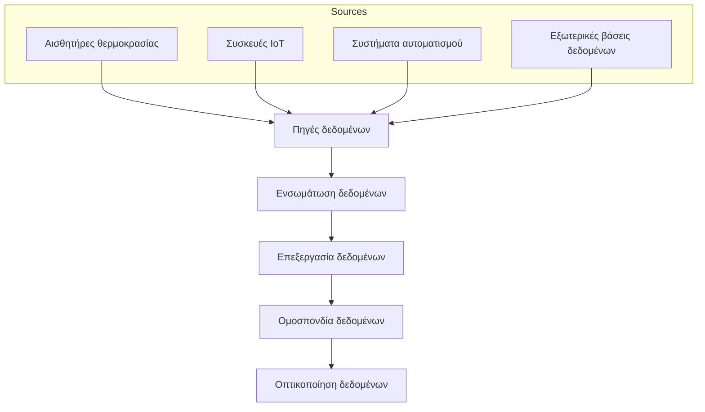

Smart home layers:

```mermaid
flowchart TB
    A[Πηγές δεδομένων] --> B[Ενσωμάτωση δεδομένων]
    B --> C[Επεξεργασία δεδομένων]
    C --> D[Ομοσπονδία δεδομένων]
    D --> E[Οπτικοποίηση δεδομένων]

    subgraph Sources
        A1[Αισθητήρες θερμοκρασίας]
        A2[Συσκευές IoT]
        A3[Συστήματα αυτοματισμού]
        A4[Εξωτερικές βάσεις δεδομένων]
    end

    A1 --> A
    A2 --> A
    A3 --> A
    A4 --> A
```
