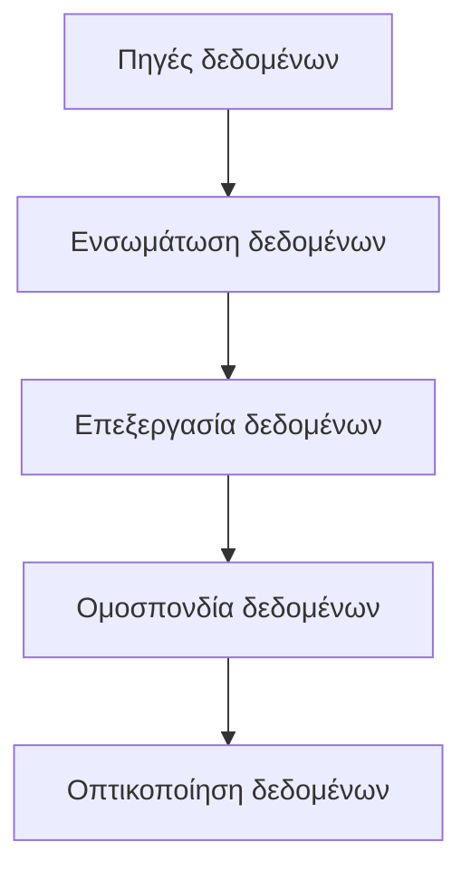
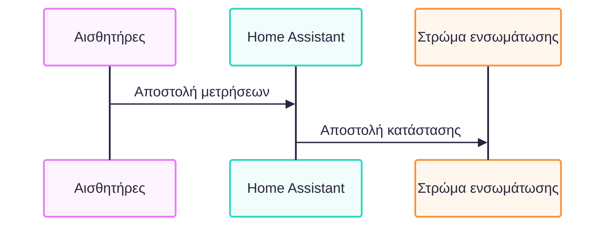
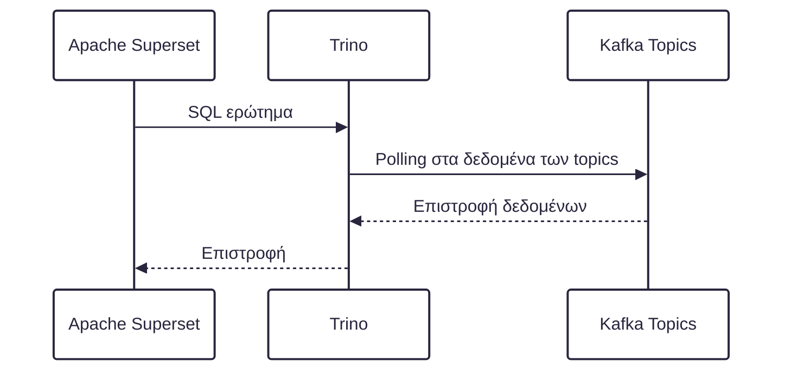
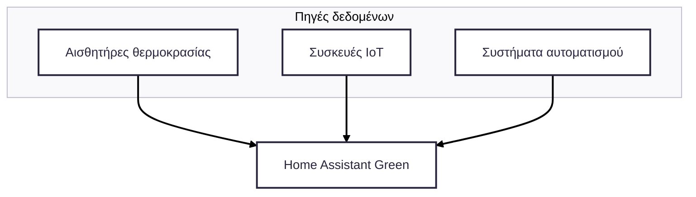
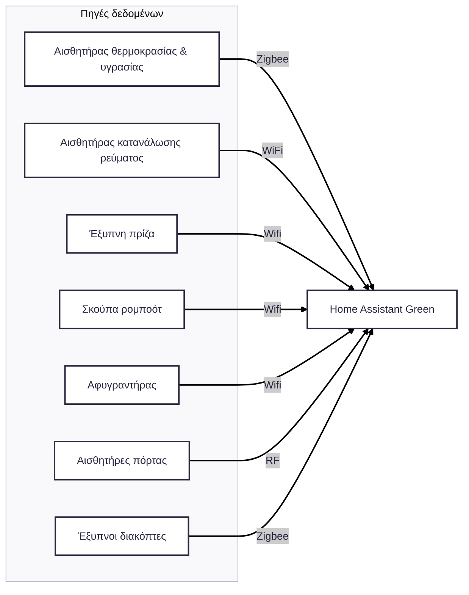
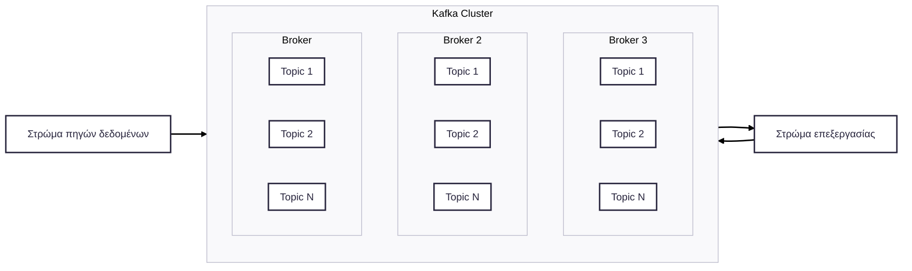
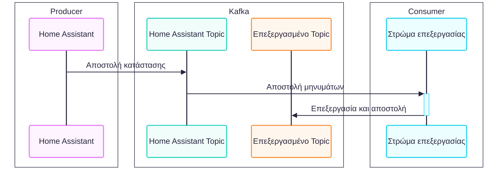
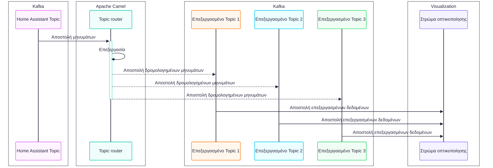
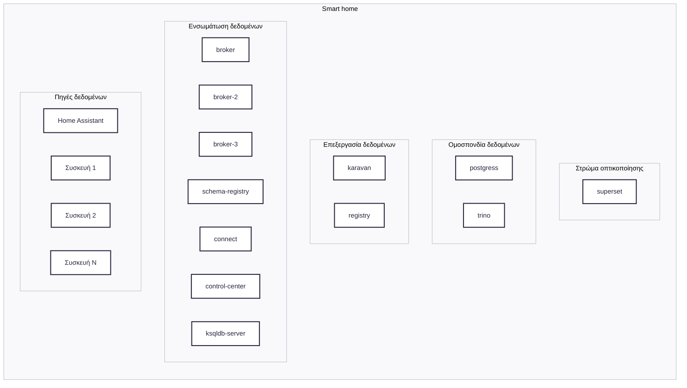
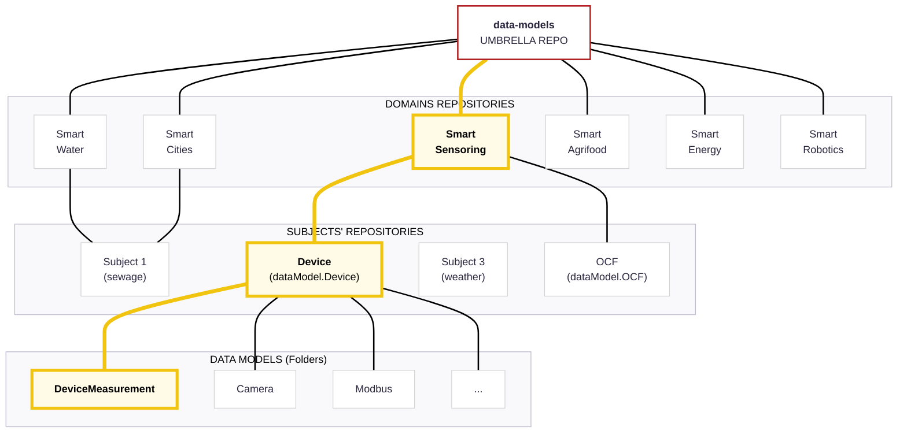

Smart home layers:

```mermaid
flowchart TB
    A[Πηγές δεδομένων] --> B[Ενσωμάτωση δεδομένων]
    B --> C[Επεξεργασία δεδομένων]
    C --> D[Ομοσπονδία δεδομένων]
    D --> E[Οπτικοποίηση δεδομένων]
```

```mermaid
---
config:
  look: classic
  theme: redux-color
---
sequenceDiagram
  participant Sensors as Αισθητήρες
  participant HomeAssistant as Home Assistant
  participant Kafka as Στρώμα ενσωμάτωσης
  Sensors ->> HomeAssistant: Αποστολή μετρήσεων
  HomeAssistant ->> Kafka: Αποστολή κατάστασης
```

```mermaid
---
config:
  look: classic
  theme: redux
---
sequenceDiagram
    participant Superset as Apache Superset
    participant Trino as Trino
    participant Kafka as Kafka Topics
    Superset->>Trino: SQL ερώτημα
    Trino->>Kafka: Polling στα δεδομένα των topics
    Kafka-->>Trino: Επιστροφή δεδομένων
    Trino-->>Superset: Επιστροφή
```

```mermaid
---
config:
  look: classic
  theme: redux
---
flowchart TB
    A1 --> B[Home Assistant Green]
    A2 --> B
    A3 --> B

    subgraph Πηγές δεδομένων
        A1[Αισθητήρες θερμοκρασίας]
        A2[Συσκευές IoT]
        A3[Συστήματα αυτοματισμού]
    end
```

```mermaid
---
config:
  look: classic
  theme: redux
---
flowchart LR
    A1 --Zigbee--> B[Home Assistant Green]
    A2 --WiFi--> B
    A3 --Wifi--> B
    A4 --Wifi--> B
    A5 --Wifi--> B
    A6 --RF--> B
    A7 --Zigbee--> B
    

    subgraph Πηγές δεδομένων
        A1[Αισθητήρας θερμοκρασίας & υγρασίας]
        A2[Αισθητήρας κατανάλωσης ρεύματος]
        A3[Έξυπνη πρίζα]
        A4[Σκούπα ρομποότ]
        A5[Αφυγραντήρας]
        A6[Αισθητήρες πόρτας]
        A7[Έξυπνοι διακόπτες]
    end
```

```mermaid
---
config:
  look: classic
  theme: redux
---
flowchart LR
    A[Στρώμα πηγών δεδομένων] -->Kafka

    subgraph Kafka[Kafka Cluster]
      subgraph Broker 3      
        subgraph Topic N
        end
        subgraph Topic 2
        end
        subgraph Topic 1
        end
      end
      subgraph Broker 2      
        subgraph Topic N
        end
        subgraph Topic 2
        end
        subgraph Topic 1
        end
      end
      subgraph Broker      
        subgraph Topic N
        end
        subgraph Topic 2
        end
        subgraph Topic 1
        end
      end
    end

    Kafka --> Processor[Στρώμα επεξεργασίας]
    Processor --> Kafka
```

```mermaid
---
config:
  look: classic
  theme: redux-color
  layout: fixed
---
sequenceDiagram
  participant HomeAssistant as Home Assistant
  participant Raw as Home Assistant Topic
  participant Clean as Επεξεργασμένο Topic
  participant P as Στρώμα επεξεργασίας
  HomeAssistant ->> Raw: Αποστολή κατάστασης
  Raw ->>+ P: Αποστολή μηνυμάτων
  P ->>- Clean: Επεξεργασία και αποστολή
  box Kafka
  participant Raw
  participant Clean
  end
  box Producer
  participant HomeAssistant
  end
  box Consumer
  participant P
  end
```

```mermaid
---
config:
  look: classic
  theme: redux-color
  layout: fixed
---
sequenceDiagram
  participant Raw as Home Assistant Topic
  participant P as Topic router
  participant Clean as Επεξεργασμένο Topic 1
  participant Clean2 as Επεξεργασμένο Topic 2
  participant Clean3 as Επεξεργασμένο Topic 3
  participant V as Στρώμα οπτικοποίησης
  Raw ->>+ P: Αποστολή μηνυμάτων
  P ->> P: Επεξεργασία
  P -->> Clean: Αποστολή δρομολογημένων μηνυμάτων
  P -->> Clean2: Αποστολή δρομολογημένων μηνυμάτων
  P -->>- Clean3: Αποστολή δρομολογημένων μηνυμάτων
  Clean ->> V: Αποστολή επεξεργασμένων δεδομένων
  Clean2 ->> V: Αποστολή επεξεργασμένων δεδομένων
  Clean3 ->> V: Αποστολή επεξεργασμένων δεδομένων
  box Kafka
    participant Raw
  end
  box Kafka
    participant Clean
    participant Clean2
    participant Clean3
  end
  box Apache Camel
    participant P
  end
  box Visualization
    participant V
  end
```

```mermaid
---
config:
  look: classic
  theme: redux
---

flowchart LR
    subgraph Smart home
        subgraph Στρώμα οπτικοποίησης
            K[superset]
        end
        subgraph Ομοσπονδία δεδομένων
            P[postgress]
            T[trino]
        end
        subgraph Επεξεργασία δεδομένων
            Ka[karavan]
            Re[registry]
        end
        subgraph Eνσωμάτωση δεδομένων
            B1[broker]
            B2[broker-2]
            B3[broker-3]
            SR[schema-registry]
            Co[connect]
            CC[control-center]
            DB[ksqldb-server]
        end
        subgraph Πηγές δεδομένων
            H[Home Assistant]
            D1[Συσκευή 1]
            D2[Συσκευή 2]
            DN[Συσκευή N]
        end
    end
```

```mermaid
---
config:
  look: classic
  theme: redux
---
graph TD
    %% Styling Definitions
    classDef highlight fill:#fffbe6,stroke:#f1c40f,stroke-width:4px,color:#000;
    classDef umbrella fill:#fff,stroke:#b22222,stroke-width:2px;
    classDef domain fill:#fff,stroke:#d3d3d3,stroke-width:1px;
    classDef subject fill:#fff,stroke:#d3d3d3,stroke-width:1px;
    classDef lifecycle fill:#fff,stroke:#b22222,stroke-width:2px;

    %% Nodes
    Umbrella["<b>data-models</b><br/>UMBRELLA REPO"]:::umbrella

    subgraph DOMAINS ["DOMAINS REPOSITORIES"]
        direction LR
        Water["Smart<br/>Water"]:::domain
        Cities["Smart<br/>Cities"]:::domain
        Sensoring["<b>Smart<br/>Sensoring</b>"]:::highlight
        Agri["Smart<br/>Agrifood"]:::domain
        Energy["Smart<br/>Energy"]:::domain
        Robot["Smart<br/>Robotics"]:::domain
    end

    subgraph SUBJECTS ["SUBJECTS' REPOSITORIES"]
        direction LR
        S1["Subject 1<br/>(sewage)"]:::subject
        Device["<b>Device</b><br/>(dataModel.Device)"]:::highlight
        S3["Subject 3<br/>(weather)"]:::subject
        OCF["OCF<br/>(dataModel.OCF)"]:::subject
    end

    subgraph MODELS ["DATA MODELS (Folders)"]
        direction LR
        DeviceMeasurement["<b>DeviceMeasurement</b>"]:::highlight
        Camera["Camera"]:::subject
        Modbus["Modbus"]:::subject
        Other["..."]:::subject
    end

    %% Connections
    Umbrella --- Water & Cities & Agri & Energy & Robot
    Umbrella === Sensoring
    
    Sensoring === Device
    Sensoring --- OCF
    
    Device === DeviceMeasurement
    Device --- Camera & Modbus & Other

    Water --- S1
    Cities --- S1

    %% Highlighting the link lines (CSS-like targeting)
    linkStyle 5,6,8 stroke:#f1c40f,stroke-width:5px;
```
