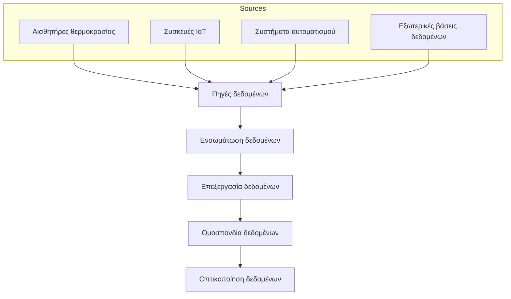
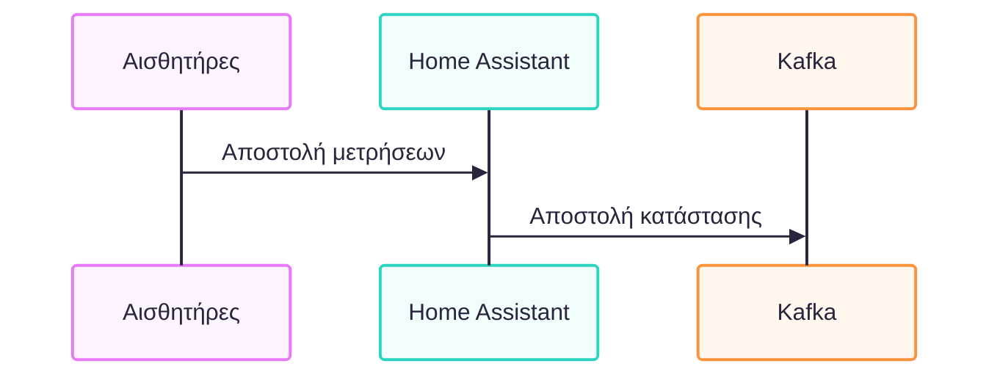
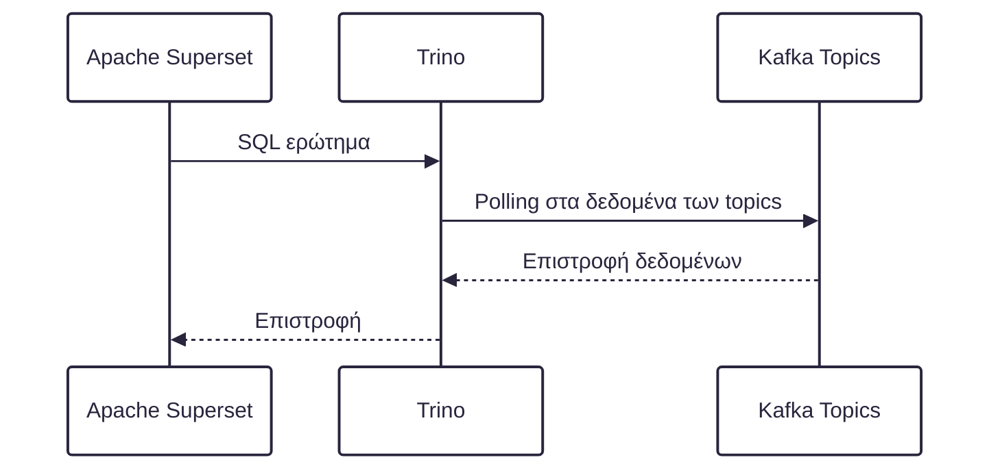
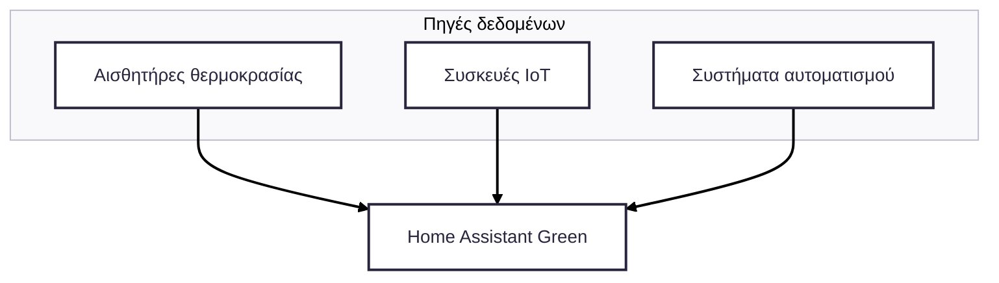

Smart home layers:

```mermaid
flowchart TB
    A[Πηγές δεδομένων] --> B[Ενσωμάτωση δεδομένων]
    B --> C[Επεξεργασία δεδομένων]
    C --> D[Ομοσπονδία δεδομένων]
    D --> E[Οπτικοποίηση δεδομένων]

    subgraph Sources
        A1[Αισθητήρες θερμοκρασίας]
        A2[Συσκευές IoT]
        A3[Συστήματα αυτοματισμού]
        A4[Εξωτερικές βάσεις δεδομένων]
    end

    A1 --> A
    A2 --> A
    A3 --> A
    A4 --> A
```

```mermaid
---
config:
  look: classic
  theme: redux-color
---
sequenceDiagram
  participant Sensors as Αισθητήρες
  participant HomeAssistant as Home Assistant
  participant Kafka as Kafka
  Sensors ->> HomeAssistant: Αποστολή μετρήσεων
  HomeAssistant ->> Kafka: Αποστολή κατάστασης
```

```mermaid
---
config:
  look: classic
  theme: redux
---
sequenceDiagram
    participant Superset as Apache Superset
    participant Trino as Trino
    participant Kafka as Kafka Topics
    Superset->>Trino: SQL ερώτημα
    Trino->>Kafka: Polling στα δεδομένα των topics
    Kafka-->>Trino: Επιστροφή δεδομένων
    Trino-->>Superset: Επιστροφή
```

```mermaid
---
config:
  look: classic
  theme: redux
---
flowchart TB
    A1 --> B[Home Assistant Green]
    A2 --> B
    A3 --> B

    subgraph Πηγές δεδομένων
        A1[Αισθητήρες θερμοκρασίας]
        A2[Συσκευές IoT]
        A3[Συστήματα αυτοματισμού]
    end
```
